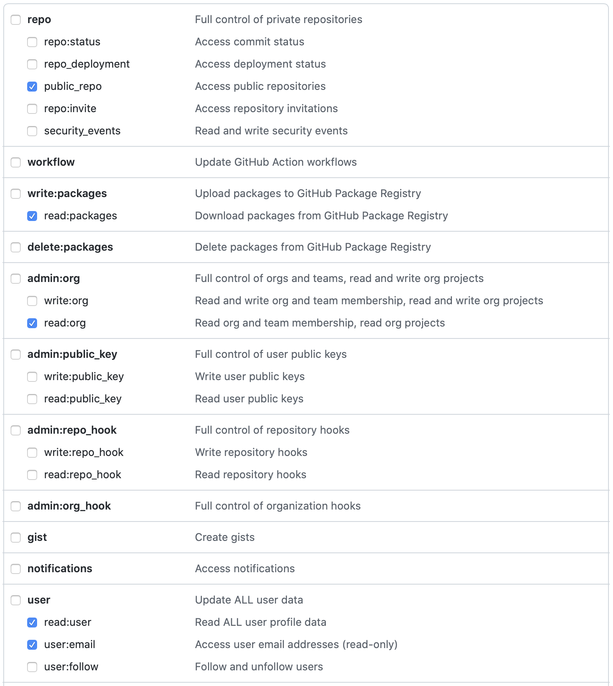

# nextjs-github-browser

[](https://github.com/topheman/nextjs-github-browser/actions/workflows/ci.yml)
[](https://github.com/topheman/nextjs-github-browser/actions/workflows/e2e.yml)
[](http://nextjs-github-browser.vercel.app/)
[](https://nextjs-github-browser.vercel.app/explore/storybook/index.html)

This project is a reimplementation of the main features of the [github.com](https://github.com) website in **NextJS**.

## Prerequisites

- Nodejs v14
- npm

## Install

```sh
git clone https://github.com/topheman/nextjs-github-browser.git
cd nextjs-github-browser
npm install
```

## Setup

This project uses the [Github GraphQL Apis](https://docs.github.com/en/graphql). You will need to [generate a personal access token](https://docs.github.com/en/authentication/keeping-your-account-and-data-secure/creating-a-personal-access-token).

- Create a `.env.local` file
- Add `GRAPHQL_API_TOKEN=***` to the file with your own token

<a href="./public/create-a-github-token.png" title="Create a token"></a>

## Development

```shell
npm run dev
```

This will start a development server on [http://localhost:3000](http://localhost:3000).

### Mocking

This project is shipped with built-in mocking for the graphql layer. It works for both client-side and server-side rendering.

- `MOCKS_MODE=record npm run dev` : will record any graphql request into `.tmp/mocks`
- `MOCKS_MODE=replay npm run dev` : will replay the mocks if available (if not, will let the request through)

You can use `MOCKS_MODE` with `record` / `replay` also on `npm start`.

You can override the target of the folder where the mocks are recorded by using `MOCKS_TARGET=./tmp/my/specific/folder` for example.

## GraphQL Schema in TypeScript

Thanks to [@octokit/graphql-schema](https://github.com/octokit/graphql-schema) and [@graphql-codegen/cli](https://www.graphql-code-generator.com), we can generate type definitions for the GraphQL queries we use.

The queries used in this project are in [src/graphql](./src/graphql).

The generated types and utils are in [src/generated/graphql.ts](./src/generated/graphql.ts).

When you modify/add a query/fragment, run `npm run graphql-codegen` to generate the types and utils.

- See [this commit for the setup](https://github.com/topheman/nextjs-github-browser/commit/4921b6b026fc34b7daeecce77858c035d619ec52)
- Thanks for the following resources:
  - https://benlimmer.com/2020/05/16/adding-typescript-types-github-graphql-api/
  - https://blog.logrocket.com/build-a-graphql-react-app-with-typescript/

## Storybook

```sh
npm run storybook
```

This will start the storybook server on [http://localhost:6006](http://localhost:6006).

## Build

```sh
npm run build
```

This will build the a production version of the website in the `.next` folder.

For production, we want to expose the storybook, to do that:

```sh
npm run build:all
```

## Production

First, you need to build your project running `npm run build:all`, then:

```shell
npm start
```

This will launch a production server on [http://localhost:3000](http://localhost:3000).

You can change the port passing a `PORT` env var like: `PORT=8080 npm start`.

## Test

### Unit

The project contains unit tests run with jest (the react part is relying on [@testing-library/react](https://testing-library.com/docs/react-testing-library/intro/))

```sh
npm run test
```

### Cypress

To run the cypress end-to-end test, launch a server in a terminal (in [dev mode](#development) or [production mode](#production)).

Then start the cypress test either:

- In gui mode: `npm run cy:open`
- In headless mode: `npm run cy:run`

## Linter

Please checkout [eslintrc.js](./.eslintrc.js) for the linting configuration:

- TypeScript
- Prettier
- Next
- React
- Tailwind
- Cypress
- ...

## Continuous Integration

Each `git push` / `PR` triggers a test suite on [github/actions](https://github.com/topheman/nextjs-github-browser/actions). The following will be ran:

- linting
- type checking
- unit tests
- end to end test with cypress

The end to end test sessions are recorded, you can check them [here](https://dashboard.cypress.io/projects/6ihjj6/runs).

## Http Caching

The `/api/github/graphql` handler is available by `POST` requests to both client and server (because it's needed for both SSR and some use cases where we call directly graphql from the client).

You have the following use cases:

1. full page render: browser -> nextjs(server) -> getServerSideProps -> `/api/github/graphql` -> github graphql api
   - GET request issued by browser
2. partial page render: browser(onRouteChange) -> nextjs(getServerSideProps) -> `/api/github/graphql` -> github graphql api
   - GET request issued by nextjs router
3. direct call to graphql from client: browser(apollo) -> `/api/github/graphql` -> github graphql api
   - POST request, cache is manage client side by Apollo

I fixed the problematic of caching for the 2nd case by adding http header `Cache-Control: private, max-age=120, must-revalidate`.

You can activate it in local by using `npm run start:cache`.

A better way would be to use some database like redis and store the payloads indexed by serialized graphql variables - this is a personal project 😉.

## Next steps

TODO

## Resources

This project is based on previous work:

- ⚛️ [topheman/nextjs-movie-browser](https://github.com/topheman/nextjs-movie-browser)
- ⚛️ [topheman/npm-registry-browser](https://github.com/topheman/npm-registry-browser)
- ️⚛️ [topheman/react-fiber-experiments](https://github.com/topheman/react-fiber-experiments)
- 📝 [Cypress.io advanced setup](http://dev.topheman.com/cypress-io-advanced-setup/)
